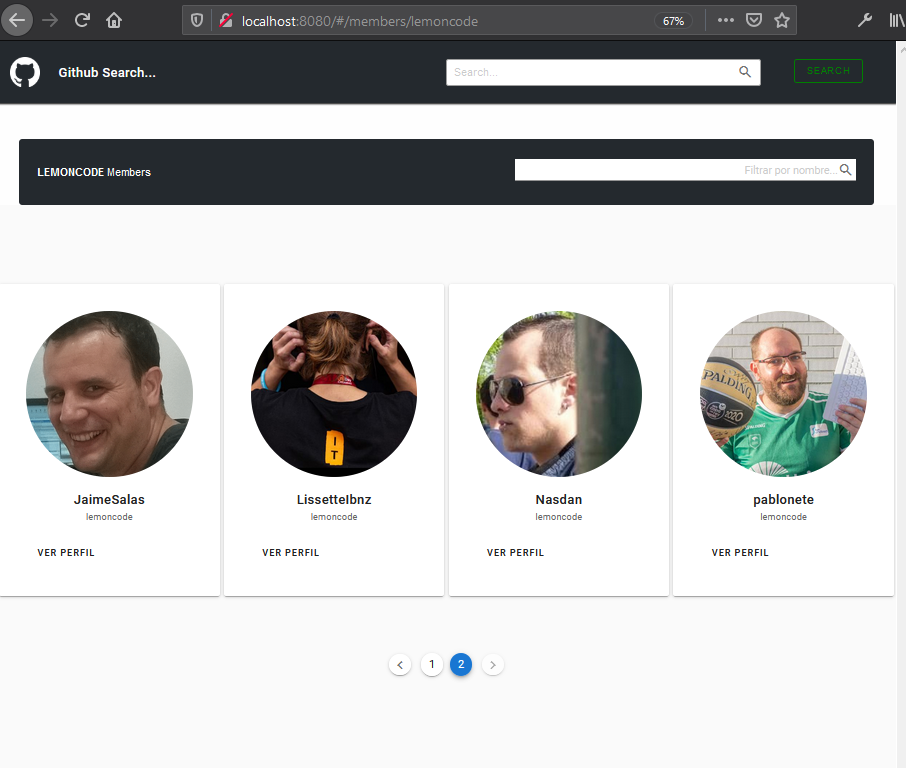
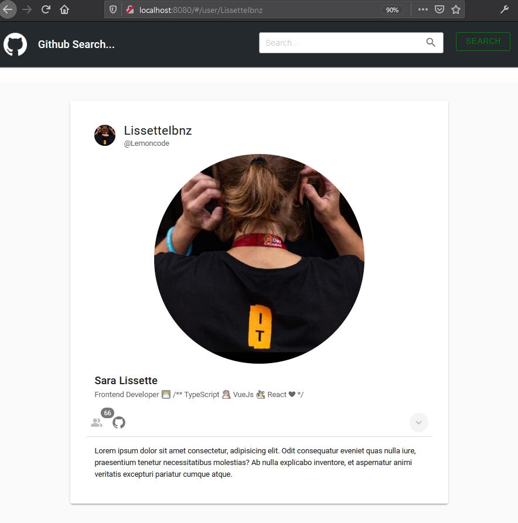
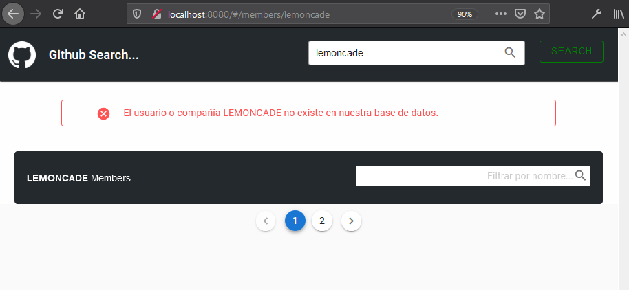

# 8 VUE Lab. GitHub Searcher

El ejercicio consiste en extender el ejemplo de mostrar los miembros de una organización que pertenece a Github.

En el [ejemplo de partida](https://github.com/Lemoncode/vuejs-excercise) está harcodeado "Lemoncode", lo que queremos es que el usuario pueda teclear cualquier organización (por ejemplo "Microsoft") y al pulsar en un botón se muestre la lista de miembros que pertenece a dicha compañia.

Se amplia con lo siguiente:

- Se ha creado un buscador general y otro de filtrado de miembros.
- Se ha añadido un spinner para mostrar un indicador de carga.
- Para el diseño se utilizan componentes personalizados y la librería Vuetify.
- La aplicación muestra un error en caso de fallo en la búsqueda.
- Se ha añadido paginación para mostrar los miembros.
- Se ha puede acceder a la vista de detalle extendida de cada miembro.

## Capturas de la aplicación

### Index

### Página de miembros de la organización

### Página de perfil individual

### Muestra de error

